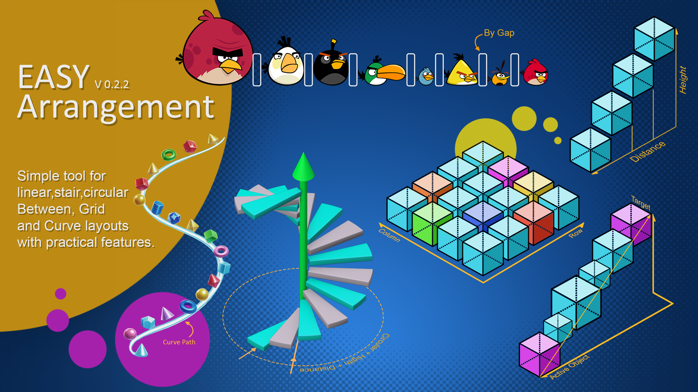
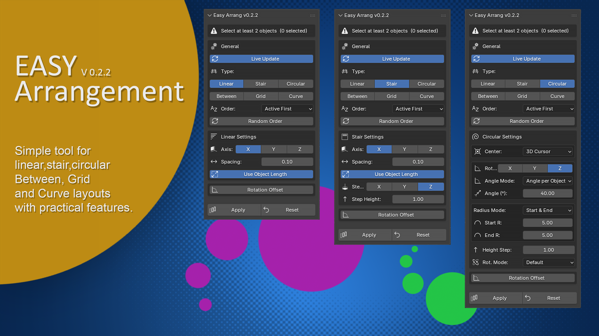
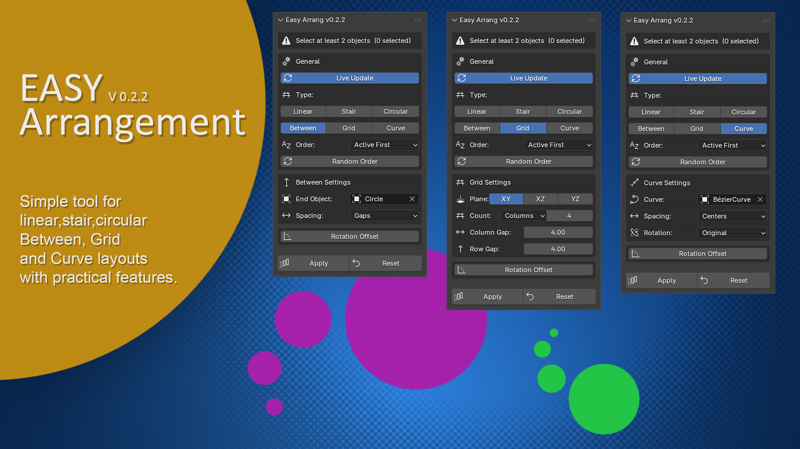

# Easy Arrangement

A Blender add-on for arranging multiple selected objects into precise **linear**, **stair-step**, or **circular** layouts — directly from a clean sidebar panel, with live preview and one-click reset.

---

## ✨ Features

### Linear Arrangement
Distributes objects along any axis (X, Y, or Z) with configurable spacing. Optionally uses each object's actual bounding box size to calculate gaps automatically, so mixed-size objects stay evenly spaced without manual adjustments.

### Stair Arrangement
Extends the linear layout with a secondary step axis and height offset, building staircase-style sequences. Step height and step axis are controlled independently — useful for architectural steps, rising formations, or layered compositions.

### Circular Arrangement
Places objects around a center point on a chosen plane (XY, XZ, or YZ).

- **Center** can be the 3D Cursor, the active object, or any object in the scene
- **Radius** can be uniform, gradually increasing from a start to an end value, or incremented by a fixed step per object
- **Angle** distribution supports both per-object angle and total arc angle modes

What makes the circular mode stand out is its **rotation handling** — three modes are available:

| Mode | Behavior |
|------|----------|
| **Default** | Objects keep their original orientation |
| **Rotate Along Axis** | Each object rotates progressively around the circular axis, following the arc |
| **Rotate Toward Center** | Each object automatically faces the center point |

### Rotation Offset
An additional independent X / Y / Z rotation offset can be layered on top of any arrangement mode — giving precise control that Blender's native Array or duplication tools don't offer in a single unified workflow.

### Live Update & Reset
**Live Update** applies changes instantly as you adjust any parameter — no need to press Apply repeatedly. **Reset** returns all selected objects to the position and orientation they had the last time they were arranged.

---

## 🖼️ Interface

The panel adapts to the selected arrangement type, showing only the relevant settings for Linear, Stair, or Circular layouts — plus a shared Rotation Offset section at the bottom.

---

## 📦 Installation

1. Download the latest `.zip` release from the [Releases](../../releases) page (or the repository as-is).
2. In Blender, go to **Edit > Preferences > Get Extensions > Install from Disk**.
3. Select the downloaded `.zip` file.
4. Enable the add-on — it will appear in the **View3D Sidebar** under the **Easy Arrang** tab.

Requires **Blender 4.2 or newer**.

---

## 🚀 Quick Start

1. Select two or more objects in the 3D Viewport.
2. Open the **Easy Arrang** tab in the sidebar (press `N` if the sidebar is hidden).
3. Choose an arrangement type: **Linear**, **Stair**, or **Circular**.
4. Adjust spacing, axis, radius, or angle settings as needed.
5. Click **Apply** — or enable **Live Update** to preview changes instantly.
6. Click **Reset** at any time to return objects to their last arranged position.

---

## 🐞 Bug Reports & Feedback

Found an issue or have a feature request? Please open an issue here:

**[github.com/mlic00/blender-easy-arrangement/issues](https://github.com/mlic00/blender-easy-arrangement/issues)**

---

## 📄 License

This project is licensed under the **GPL-3.0-or-later** license — see the [LICENSE](LICENSE) file for details.

---

## 🙌 Author

Created and maintained by **mlico**.
